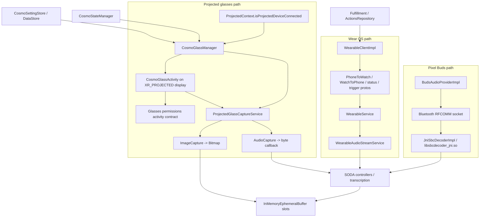

# Glasses Link Research

## Scope

This report maps what the recovered Cosmo artifacts show about communication with glasses and adjacent companion devices. The evidence comes from:

- Recovered smali under `/Users/mac/Downloads/cosmo_baksmali`.
- Recovered native libraries under `/Users/mac/Downloads/cosmo_recovered_native_libs`.
- Recovered large assets under `/Users/mac/Downloads/cosmo_recovered_large_assets`.
- Integrity and architecture notes under `/Users/mac/Downloads/cosmo_artifact_integrity` and `/Users/mac/cosmo-dev/repo/docs`.

The important distinction: the APK has one true projected-glasses path, one Wear OS companion path, one Pixel Buds Bluetooth audio path, and one Altair/Glimmer ambient-context binder path. Only the first is explicitly a glasses path. The other paths are adjacent companion-device links that can feed or mirror Cosmo state.

## Executive Summary

Cosmo does not expose a raw BLE, RFCOMM, TCP, or WebSocket protocol for glasses in its own code. The glasses path is built on Google/Android projected-XR APIs:

- `androidx.xr.projected.ProjectedContext.isProjectedDeviceConnected(...)`
- `androidx.xr.projected.ProjectedContext.createProjectedActivityOptions(...)`
- `com.google.android.glasses.shared.ai.experimental.apis.projectedcapture.service.ProjectedGlassCaptureService`
- `com.google.android.glasses.sdk.permissions.standardactivity.*`

The app starts a projected `CosmoGlassActivity` on an XR projected display, obtains permissions there, starts/binds `ProjectedGlassCaptureService`, then calls service methods to capture glass camera frames and audio. The actual transport below `ProjectedGlassCaptureService` is hidden in the vendor/service layer, not implemented in Cosmo smali.

The watch path is a separate Google Play Services Wearable Data Layer integration using `NodeClient`, `MessageClient`, and `ChannelClient`. It uses stable `/cosmowear/...` paths and protobuf payloads for phone/watch status, triggers, actions, and audio streams.

The Pixel Buds path uses classic Bluetooth RFCOMM with an app-specific SPP UUID, reads audio bytes from a `BluetoothSocket`, decodes SBC via `libsbcdecoder_jni.so`, and feeds SODA. This is not used by `CosmoGlassManager`, but it is another recovered companion audio ingress path.

## High-Level Architecture



## Link 1: Projected Glasses Capture

### Main Classes

Recovered classes:

- `com/google/research/air/cosmo/glasses/CosmoGlassManager.smali`
- `com/google/research/air/cosmo/glasses/CosmoGlassActivity.smali`
- `com/google/research/air/cosmo/glasses/CosmoGlassViewModel.smali`
- `com/google/research/air/cosmo/glasses/GlassCaptureServiceState.smali`
- `com/google/research/air/cosmo/glasses/GlassUIState.smali`

External classes referenced by smali:

- `androidx.xr.projected.ProjectedContext`
- `com.google.android.glasses.shared.ai.experimental.apis.projectedcapture.service.ProjectedGlassCaptureService`
- `com.google.android.glasses.shared.ai.experimental.apis.projectedcapture.audio.ProjectedAudioCaptureManager$AudioConfig`
- `com.google.android.glasses.sdk.permissions.standardactivity.GlassesPermissionsRequestData`
- `com.google.android.glasses.sdk.permissions.standardactivity.RequestGlassesPermissions`

Manifest evidence from `repo/docs/runtime_topology_map.md` shows `CosmoGlassActivity` has `requiredDisplayCategory="android.hardware.display.category.XR_PROJECTED"` and is not exported. The manifest also declares `ProjectedGlassCaptureService` as a non-exported foreground service with microphone+camera foreground-service type.

### Lifecycle

`CosmoGlassManager` is a Hilt singleton. It is constructed with:

- `Context`
- background coroutine scope
- `CosmoSettingStore`
- `CosmoStateManager`
- `@GlassesCameraEphemeralBuffer InMemoryEphemeralBuffer<Bitmap>`

The constructor creates:

- `_isGlassServiceBound: MutableStateFlow<Boolean>`
- `isGlassServiceBound: StateFlow<Boolean>`
- `isGlassConnected: StateFlow<Boolean>` from `ProjectedContext.isProjectedDeviceConnected(...)`
- `shouldGlassAudioRun: StateFlow<Boolean>`
- `shouldGlassCameraRun: StateFlow<Boolean>`
- a `ServiceConnection` for `ProjectedGlassCaptureService`

The service link is maintained by coroutines and `StateFlow` gates. `bindGlassCaptureService()` avoids duplicate binding if already bound or if a binding job is active. On connection, the binder is cast to `ProjectedGlassCaptureService$LocalBinder`, `getService()` is stored, and `_isGlassServiceBound` is set `true`. On disconnect, the manager logs the disconnect, stops the projected activity, clears the service reference, and resets bound state.

### Settings Gates

The glasses path is gated by:

- `CosmoSettingStore.isConnectToGlassEnabled()`
- `CosmoSettingStore.isGlassesCameraEnabled()`
- `CosmoSettingStore.isAmbientAudioEnabled()`
- `CosmoStateManager` / global Cosmo state
- `ProjectedContext.isProjectedDeviceConnected(...)`
- the projected activity/service bound state

The settings map in `repo/docs/settings_and_config_map.md` explicitly maps:

- `isGlassesCameraEnabled()` -> `CosmoGlassManager.setupGlassCameraCapture`
- `isConnectToGlassEnabled()` -> `CosmoGlassManager.bindGlassCaptureService`

### Activity and Permission Flow

`CosmoGlassManager.startGlassActivityAndBindService(...)` does the projected launch:

- Calls `ProjectedContext.createProjectedActivityOptions(context)`.
- Creates an `Intent(context, CosmoGlassActivity::class.java)`.
- Adds `FLAG_ACTIVITY_NEW_TASK`.
- Starts the activity with projected `ActivityOptions.toBundle()`.
- Starts binding to `ProjectedGlassCaptureService`.
- Waits until `_isGlassServiceBound` becomes `true`.

`CosmoGlassActivity` checks and requests:

- `android.permission.CAMERA`
- `android.permission.RECORD_AUDIO`
- `android.permission.POST_NOTIFICATIONS`

The permission request uses `RequestGlassesPermissions` and `GlassesPermissionsRequestData` with the prompt text:

```text
Need audio & camera recording permission for glass.
```

Once permissions are granted, `CosmoGlassActivity`:

- Starts `ProjectedGlassCaptureService` as a foreground service.
- Binds to it.
- Sets `GlassCaptureServiceState` initialized when connected.
- Passes the service instance to `CosmoGlassViewModel.onServiceConnected(...)`.

The activity also honors an internal `finish_activity` extra. `CosmoGlassManager.stopGlassActivity()` sends a projected intent with `finish_activity=true` to finish the projected UI and resets glass state.

### Camera Flow

`CosmoGlassManager.setupGlassCameraCapture()` calls:

```text
ProjectedGlassCaptureService.setupImageCapture(...)
```

with a callback receiving `androidx.camera.core.ImageProxy`.

The callback:

- Throttles frames with `FRAME_PROCESS_INTERVAL_MS = 0x2710` (10 seconds), matching `GLASS_CAMERA_TARGET_FPS = 0.1`.
- Logs `"Glass camera frame captured"`.
- Converts the frame via `ImageProxy.toBitmap()`.
- Inserts the `Bitmap` into `@GlassesCameraEphemeralBuffer`.
- Closes skipped frames via `ImageProxy.close()`.

Start/stop calls are direct service calls:

```text
ProjectedGlassCaptureService.startImageCapture()
ProjectedGlassCaptureService.stopImageCapture()
```

### Audio Flow

`CosmoGlassManager.startGlassAudioCapture(Function2<byte[], Int, Unit>)` calls:

```text
ProjectedGlassCaptureService.startAudioCapture(audioConfig, onAudioDataListener)
```

`stopGlassAudioCapture()` calls:

```text
ProjectedGlassCaptureService.stopAudioCapture()
```

The audio config is a `ProjectedAudioCaptureManager$AudioConfig` built in the manager constructor. The exact numeric fields are not named in smali, but the service API clearly accepts an audio config plus a byte-buffer/read-count callback.

`SODAAmbientAudioCaptor` has a `CosmoGlassManager` dependency and includes `onGlassAudioData(byte[], int)`, so projected-glass audio is folded into the same SODA transcription/audio captor pipeline as ambient microphone audio.

### What The Link Is

The glasses link visible from Cosmo is:

```text
Cosmo app process -> Android projected activity/service APIs -> vendor ProjectedGlassCaptureService
```

It is an Android Binder/service boundary plus XR projected-display engagement. Cosmo smali does not show a raw radio transport for glasses. No app-owned BLE GATT, classic Bluetooth socket, TCP socket, WebSocket, USB serial, or custom native protocol appears in the glasses manager/activity path.

The transport from `ProjectedGlassCaptureService` to the physical glasses is outside the recovered APK.

## Link 2: Wear OS Companion Data Layer

The watch path is not the projected-glasses path, but it is a complete companion-device communication stack in the recovered APK.

### Main Classes

- `lib/wearable/WearableClientImpl.smali`
- `lib/wearable/WearableService.smali`
- `lib/wearable/WearableAudioStreamService.smali`
- `lib/wearable/WearableActionSynchronizer.smali`
- `lib/wearable/WearableStatusSynchronizer.smali`
- Generated protobuf classes under `lib/wearable/`

`WearableModule$Companion` provides Google Play Services clients:

```text
Wearable.getNodeClient(context)
Wearable.getMessageClient(context)
Wearable.getChannelClient(context)
```

The manifest declares `WearableService` as a `WearableListenerService` with:

```text
MESSAGE_RECEIVED
CHANNEL_EVENT
data scheme="wear" host="*" pathPrefix="/cosmowear"
```

### Message and Channel Paths

Observed paths:

| Path | Direction | Mechanism | Payload |
|---|---|---|---|
| `/cosmowear/action_update` | phone -> watch and watch -> phone | `MessageClient.sendMessage` / `onMessageReceived` | phone sends `PhoneToWatch`; watch sends `WatchToPhone` |
| `/cosmowear/status` | both directions | `MessageClient.sendMessage` / `onMessageReceived` | phone sends `CosmoPhoneStatus`; watch sends `CosmoWatchStatus` |
| `/cosmowear/trigger` | watch -> phone | `MessageClient` | `CosmoTrigger` |
| `/cosmowear/mic_stream` | watch -> phone | `ChannelClient.Channel` | raw audio stream read by `WearableAudioStreamService` |
| `/cosmowear/mic_stream_stop` | watch -> phone | `MessageClient` | empty or control message; stops `WearableAudioStreamService` |
| `/cosmowear/watch_audio_out_stream` | phone -> watch | `ChannelClient.openChannel` | phone opens an output stream to the watch |
| `/cosmowear/watch_play_audio` | phone -> watch | `MessageClient.sendMessage` | empty control message telling watch to play audio |

### Phone-To-Watch Payloads

`PhoneToWatch` is a protobuf with one repeated field:

```text
actions: repeated com.google.research.air.cosmo.agents.proactivesuggestions.ProactiveSuggestion
```

`WearableClientImpl.sendActionUpdate(...)` serializes `PhoneToWatch.toByteArray()` and sends it over `/cosmowear/action_update` to every connected node.

`CosmoPhoneStatus.Status` values include:

- `PHONE_STATUS_UNSPECIFIED`
- `COSMO_OFF`
- `AMBIENT_AUDIO_OFF`
- `LISTENING_AMBIENT`
- `CHAT_LISTENING`
- `CHAT_PROCESSING`
- `CHAT_RESPONDING`

`WearableStatusSynchronizer` maps `ChatState`/Cosmo state to `CosmoPhoneStatus` and sends it over `/cosmowear/status`.

### Watch-To-Phone Payloads

`WatchToPhone` is a protobuf with:

```text
type: WatchToPhone.UpdateType
action_id: string
```

`WatchToPhone.UpdateType` values:

- `UNKNOWN`
- `REMOVE_ACTION`
- `EXECUTE_ACTION`
- `REQUEST_SYNC`
- `MARK_ACTION_AS_EXECUTED`
- `UNRECOGNIZED`

`WearableService.handleActionUpdate(...)` responds as follows:

- `REMOVE_ACTION`: mark action dismissed in `ActionsRepository`.
- `EXECUTE_ACTION`: find the action by ID and execute through `FulfillmentActionHandler`.
- `REQUEST_SYNC`: call both action and status synchronizers' `proactiveSync()`.
- `MARK_ACTION_AS_EXECUTED`: mark the action executed.
- Unknown/unrecognized: log a warning.

`CosmoTrigger.ActionType` values:

- `BOOKMARK`
- `START_CHAT`
- `END_CHAT`
- `ACTION_TYPE_UNSPECIFIED`
- `UNRECOGNIZED`

`WearableService.handleTrigger(...)` maps these to bookmarking, starting chat, or ending chat.

`CosmoWatchStatus.Status` values:

- `WATCH_STATUS_UNSPECIFIED`
- `AMBIENT_AUDIO_OFF`
- `AMBIENT_AUDIO_STREAMING`
- `PLAYING_AUDIO`
- `DISCONNECTED`

Watch status updates are keyed by `MessageEvent.getSourceNodeId()` and written through `WatchStatusWriter`.

### Watch Audio Stream

When `WearableService.onChannelOpened(...)` sees `/cosmowear/mic_stream`, it starts `WearableAudioStreamService` and passes the `Channel` as `EXTRA_CHANNEL`.

`WearableAudioStreamService` owns:

- `receiveAudioStream(ChannelClient.Channel)`
- an `InputStream`
- injected `SODAWatchAudioCaptor`
- foreground service notification/channel plumbing

`SODAWatchAudioCaptor` uses a `@WatchAudioSodaController`, exposes `startCapture(): Flow<TranscriptionData>`, and feeds incoming bytes to `SodaController.addAudioBytes(byte[])`. Its logs include:

```text
Starting Watch SODA capture
Watch SODA transcription: %s
Stopping Watch SODA capture
```

## Link 3: Pixel Buds RFCOMM Audio

This is not the projected-glasses path, but it is the only recovered app-owned classic Bluetooth socket path.

### Main Classes

- `audiocapture/SODABudsAudioCaptor.smali`
- `lib/buds/BudsAudioProvider.smali`
- `lib/buds/BudsAudioProviderImpl.smali`
- `lib/buds/AudioDevice.smali`
- `lib/buds/AudioDeviceType.smali`
- `lib/buds/AudioChunk.smali`
- `lib/buds/ProviderState*.smali`

### Link Details

`BudsAudioProvider$Companion` defines:

```text
SPP_UUID = 25e97ff7-24ce-4c4c-8951-f764a708f7b4
```

`BudsAudioProviderImpl$start$2$1` calls:

```text
BluetoothDevice.createInsecureRfcommSocketToServiceRecord(SPP_UUID)
BluetoothSocket.connect()
```

`BudsAudioProviderImpl.streamAudio(...)` calls:

```text
BluetoothSocket.getInputStream()
InputStream.read(byte[])
MutableSharedFlow<AudioChunk>.emit(...)
```

The provider maintains:

- `budsSocket: BluetoothSocket?`
- `connectionJob: Job?`
- `connectionMutex: Mutex`
- `_connectionState: MutableStateFlow<ProviderState>`
- `_audioData: MutableSharedFlow<AudioChunk>`

`ProviderState` is a sealed-style state family:

- `Idle`
- `Connecting`
- `Streaming(device)`
- `Error(message)`

Recovered strings show lifecycle logging:

```text
RFCOMM connected to %s
RFCOMM stream ended.
RFCOMM socket closed during read.
Error reading from RFCOMM stream.
Stopping RFCOMM connection.
RFCOMM connection stopped, state set to Idle.
```

`SODABudsAudioCaptor` uses `JniSbcDecoderImpl`, backed by `libsbcdecoder_jni.so`, before feeding SODA.

Permission evidence includes `android.permission.BLUETOOTH_CONNECT`.

## Link 4: Altair / Glimmer Ambient Context Binder

The recovered APK also contains `altair/AltairActionSynchronizer.smali`, which binds to:

```text
com.google.research.air.experiences.glimmer.altair.api.ipc.ICosmoAmbientContextService
```

This path is gated by:

```text
CosmoSettingStore.isAltairSyncEnabled()
```

It observes fulfillment actions, serializes the latest action to JSON with `FulfillmentAction.Companion.getGson().toJson(...)`, and calls methods on `ICosmoAmbientContextService`. If no actions are present it calls:

```text
clearAmbientContext()
```

Recovered logs include:

```text
PEKINGDUCK calling clearAmbientContext
PEKINGDUCK in sendActionsToAltair with actions: %s
Actions JSON string is too large: %d chars
```

The exact external service binding action/package was not fully recovered in the snippets I inspected, but the API name and permission evidence point to a separate Glimmer/Altair ambient-context surface rather than the direct `ProjectedGlassCaptureService` camera/audio path.

## Native Libraries

Recovered native libraries:

```text
libandroidx.graphics.path.so
libbert_gatekeeper_jni.so
libdarwinndelegatejni.so
libfilterframework_jni.so
libimage_processing_util_jni.so
liboak_session_config_builder_jni.so
libpi_client_session_config_jni.so
libsbcdecoder_jni.so
libsoda_dev_jni.so
libsurface_util_jni.so
libtensorflowlite_jni.so
libtensorflowlite_jni_stable.so
libvogo_jni.so
```

Native-string inspection did not reveal a hidden glasses radio protocol. The relevant roles are:

- `libsbcdecoder_jni.so`: Pixel Buds SBC audio decode for the RFCOMM path.
- `libsoda_dev_jni.so`: SODA speech/audio processing.
- `libimage_processing_util_jni.so` and `libsurface_util_jni.so`: CameraX image/surface helpers.
- `libbert_gatekeeper_jni.so`, `libtensorflowlite_jni*.so`, `libdarwinndelegatejni.so`: local gatekeeper/model inference.
- `liboak_session_config_builder_jni.so` and `libpi_client_session_config_jni.so`: private inference/Oak session support, unrelated to the glasses link.
- `libvogo_jni.so`: Voice/audio model support.

The key point: native artifacts support audio, vision, model execution, and remote inference, but the glasses communication boundary visible in recovered code is the Java/Kotlin projected-capture service API.

## Recovered Assets

`/Users/mac/Downloads/cosmo_recovered_large_assets` contains model and speech assets linked to the Cosmo APK, including:

```text
assets__gatekeeper__audio_frontend.tflite
assets__gatekeeper__audio_gatekeeper_edgetpu.tflite
assets__gatekeeper__bert_v0_cpu.tflite
assets__gatekeeper__bert_v0_p24.tflite
assets__gatekeeper__bert_v0_p25.tflite
assets__gatekeeper__bert_vocab.txt
assets__gecko__gecko_out256_tpu_v0.tflite
assets__gecko__i18n_sentencepiece.model
assets__soda__lp_cpu.zip
assets__soda__lp_lga_tpu.zip
assets__soda__lp_zuma_tpu.zip
assets__voicelm__encoder_int4-graph-custom_op.tflite
assets__voicelm__merged_depth_decoder_int4-graph-custom_op.tflite
assets__voicelm__soundstream_decoder_tpu.tflite
assets__voicelm__soundstream_encoder_tpu.tflite
assets__voicelm__soundstream_quantizer.tflite
assets__voicelm__temporal_decoder_int4-graph-custom_op.tflite
```

`cosmo_artifact_integrity/asset_completeness.md` reports:

- APK size: 1,432,600,576 bytes.
- 1,242 local ZIP entries found.
- 1,241 complete entries.
- 81 of 82 asset entries complete.
- 13 native libraries complete.
- The only known partial entry is `assets/voicelm/temporal_decoder_int4-graph-custom_op.tflite`.

These assets are not "links" to glasses by themselves. They are processing payloads used after data enters Cosmo:

- Glass camera frames become `Bitmap` entries in `GlassesCameraEphemeralBuffer`.
- Glass/watch/buds audio becomes bytes/transcriptions through SODA and audio gatekeeping.
- Gatekeeper and Gecko/VoiceLM assets score, embed, or classify captured context.

## How The Link Is Maintained

### Dependency Injection

Hilt wires the long-lived pieces:

- `CosmoGlassManager_Factory`
- `WearableClientImpl_Factory`
- `WearableActionSynchronizer_Factory`
- `WearableStatusSynchronizer_Factory`
- `WearableAudioStreamService_MembersInjector`
- `BudsAudioProviderImpl_Factory`
- per-source captor factories such as `SODAWatchAudioCaptor_Factory` and `SODABudsAudioCaptor_Factory`

Qualifier annotations keep streams separate:

- `GlassesCameraEphemeralBuffer`
- `WatchAudioCaptor`
- `WatchAudioEphemeralBuffer`
- `WatchAudioSodaController`
- `BudsAudioCaptor`
- `BudsAudioEphemeralBuffer`
- `BudsAudioSodaController`

### State

Runtime state is mostly `StateFlow` / `MutableStateFlow`:

- Glass service bound/unbound.
- Glass connected/disconnected.
- Glass audio/camera should-run gates.
- Buds connection state.
- Watch status state.
- Actions repository state.
- Chat/Cosmo status state.

### Settings

Settings are persisted through `CosmoSettingStore` / DataStore. Important toggles:

- `isConnectToGlassEnabled`
- `isGlassesCameraEnabled`
- `isAmbientAudioEnabled`
- `isWatchAudioEnabled`
- `isStreamToWatchEnabled`
- `isBudsAudioEnabled`
- `isAltairSyncEnabled`
- `getEphemeralBufferDurationMin`

### Foreground Services

Long-running capture and stream work is held by services:

- `ProjectedGlassCaptureService`: microphone + camera foreground-service type.
- `WearableAudioStreamService`: dataSync foreground-service type.
- `RecordService`: microphone foreground-service type.

### Backpressure and Cleanup

Recovered code shows several safety boundaries:

- Glass camera frames are throttled to one every 10 seconds.
- Glass camera values go through an ephemeral buffer and can be cleared.
- Wearable audio streaming is channel-scoped and stopped on `/cosmowear/mic_stream_stop`.
- Buds RFCOMM has a mutex, job, socket close handling, and state reset.
- Protobuf parse failures in `WearableService` are caught and logged.

## Reachability Notes

Proven/reasonable from static evidence:

- Wear OS link is an app-level protocol over Google Play Services Wearable Data Layer.
- Pixel Buds link is app-level classic Bluetooth RFCOMM using UUID `25e97ff7-24ce-4c4c-8951-f764a708f7b4`.
- Glasses link is a vendor projected-capture service API plus XR projected activity.
- The app-visible glasses path requires projected-display support and the external projected capture service.

Not proven by recovered artifacts:

- The radio/transport used underneath `ProjectedGlassCaptureService`.
- Any app-owned BLE GATT profile for glasses.
- Any direct network socket between Cosmo and glasses.
- A standalone glasses APK/package protocol beyond Android projected-XR and Google glasses SDK classes.
- Runtime success on a non-projected retail phone; existing docs mark projected capture/vendor-only glasses engagement as not generally reachable without matching device/service support.

## Practical Reimplementation Targets

For an interop implementation, preserve the public shape rather than copying vendor internals:

1. Implement a `GlassLink` abstraction with `connected: StateFlow<Boolean>`, `bound: StateFlow<Boolean>`, `startAudioCapture(callback)`, `stopAudioCapture()`, `setupImageCapture(callback)`, `startImageCapture()`, `stopImageCapture()`, and `clear()`.
2. Use the recovered projected path when the real `ProjectedGlassCaptureService` exists.
3. Provide a fallback implementation for other glasses hardware that maps camera/audio into the same `InMemoryEphemeralBuffer<Bitmap>` and SODA byte callback surfaces.
4. Keep Wear OS `/cosmowear/...` paths compatible if building a watch companion.
5. Keep Pixel Buds RFCOMM separate from glasses; it is an audio source implementation, not a glasses transport.

